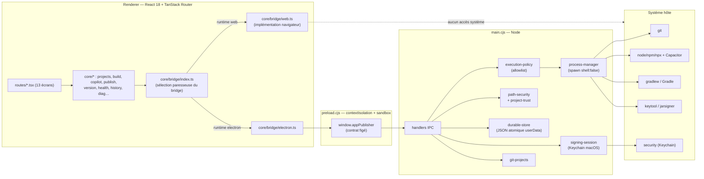

# 01 — État des lieux réel du dépôt

## 1.1 Identité du code audité

| Élément | Valeur | Preuve |
| --- | --- | --- |
| Branche | `edit/edt-8113ed59-36c0-4f29-bedb-15c15ec99e85` | `EXEC` `git rev-parse --abbrev-ref HEAD` |
| Commit | `fb597f5a48828851a1c85db17d7a4818d4f79aab` (4 août 2026 21:59 UTC, message « Changes ») | `EXEC` `git log -1` |
| Modifications non suivies | aucune (0 ligne de `git status --porcelain`) | `EXEC` |
| Version applicative | `version.json` → `{ "version": "1.0.0", "build": 1 }` | `CODE` `version.json` |

**Constat CODE-001 (P3)** — l'historique n'est pas exploitable : le dernier commit s'appelle « Changes ». Aucune convention de message, donc aucune traçabilité produit ni génération de notes de version automatisable.

## 1.2 Environnement

| Outil | Version | Preuve |
| --- | --- | --- |
| Node | v22.22.0 | `EXEC` `node -v` |
| npm | 10.9.4 | `EXEC` `npm -v` |
| Electron | `^43.0.0` (devDependency) | `CODE` package.json |
| electron-builder | `^26.15.3` | `CODE` package.json |
| Vite | `^8.0.16` | `CODE` package.json |
| React / React DOM | `18.3.1` (épinglé) | `CODE` package.json |
| TypeScript | `^5.8.3` | `CODE` package.json |
| Vitest | `^4.1.9` | `CODE` package.json |
| TanStack Router / Start | `^1.170.16` / `^1.168.26` | `CODE` package.json |

### Lockfile

**Constat BUILD-001 (P1)** — le seul lockfile présent est `bun.lock` (261 Ko). Il n'existe **ni `package-lock.json` ni `yarn.lock`**. Or :

- `scripts/pack.cjs` lance `npx vite build` puis `npx electron-builder` (`CODE` scripts/pack.cjs, blocs 4 et 5) ;
- `electron/README.md` documente `npm install --save-dev electron electron-builder` et `npm run pack:mac` ;
- electron-builder a lui-même signalé pendant le packaging : `note: bun does not support any CLI for dependency tree extraction, utilizing file traversal collector instead` (`EXEC`).

Conséquence : aucune installation reproductible n'est possible avec npm (`npm ci` impossible), et l'arbre de dépendances embarqué dans le paquet est déterminé par une heuristique de parcours de fichiers, non par un lockfile. Pour un produit distribué, c'est un risque de supply chain et de non-reproductibilité des builds.

**Constat BUILD-002 (P2)** — `electron` et `electron-builder` sont en `devDependencies` avec des plages `^`. Un `bun install` ultérieur peut basculer sur Electron 44/45 sans intervention : le runtime du produit livré n'est pas épinglé.

## 1.3 Scripts réellement disponibles

`CODE` package.json :

```
dev, build, build:dev, preview, test, typecheck, lint, format,
sync:version, build:electron, electron:dev, make:icons, pack:mac, pack:win
```

Il n'existe **aucun** script : `test:e2e`, `test:watch`, `ci`, `release`, `notarize`, `publish`. Il n'y a **aucun** fichier de CI (`.github/`, `.gitlab-ci.yml` absents).

**Constat QA-001 (P1)** — aucune intégration continue. Rien n'empêche de livrer un commit dont le lint, les tests ou le packaging sont cassés — situation constatée ci-dessous.

## 1.4 Structure et points d'entrée

```text
/
├─ electron/            16 fichiers .cjs — 4 895 lignes (main process)
│  ├─ main.cjs (2 397 l.)          orchestrateur + tous les handlers IPC
│  ├─ preload.cjs                  contextBridge
│  ├─ execution-policy.cjs         allowlist des commandes
│  ├─ path-security.cjs            canonicalisation / racines autorisées
│  ├─ project-trust.cjs            approbation des dossiers projet
│  ├─ git-projects.cjs (465 l.)    clone / status / check / sync
│  ├─ signing-session.cjs          secrets keystore
│  ├─ durable-store.cjs (369 l.)   persistance JSON atomique
│  ├─ process-manager.cjs          spawn / annulation
│  ├─ backup-manager.cjs           sauvegarde / restauration
│  ├─ android-preparation.cjs      création config Android
│  ├─ gradle-*.cjs                 gradlew + patch de signature
│  ├─ diagnostic-redaction.cjs     masquage des secrets dans les logs
│  ├─ window-security.cjs          navigation / permissions
│  └─ external-url.cjs             ouverture de liens
├─ src/                225 fichiers .ts/.tsx — 27 333 lignes (renderer)
│  ├─ main.electron.tsx            point d'entrée SPA Electron (hash history)
│  ├─ server.ts / start.ts         point d'entrée SSR web (Lovable)
│  ├─ routes/                      13 routes
│  ├─ core/                        26 domaines métier
│  ├─ features/android-signing/    module signature
│  └─ components/                  UI + shadcn
├─ tests/               15 suites `*.node-test.cjs` (main process, sans Electron)
├─ scripts/             pack.cjs, sync-version.cjs, make-icons.sh
├─ build/               icon.png, icon.icns, icon.ico, entitlements.mac.plist
├─ index.html           shell SPA Electron (CSP en meta)
├─ vite.config.ts       pipeline web SSR (Lovable)
├─ vite.electron.config.ts  pipeline SPA Electron
└─ electron-builder.config.cjs + app.config.cjs
```

### Architecture réelle



**Constat ARCH-001 (P2)** — `src/routes/**` et `src/core/**` sont partagés à l'identique par **deux runtimes très différents** : la SPA Electron (`main.electron.tsx`, hash history, bridge natif) et le site SSR web (`server.ts`/`start.ts`, bridge mocké). Aucun test ne vérifie la compatibilité SSR des écrans, et un seul défaut de garde `window` casse le rendu web (historique du projet : le 404 en `file://` et le wizard bloqué relevaient exactement de cette double cible).

## 1.5 Commandes de validation — résultats mesurés

Toutes les commandes ci-dessous ont été exécutées le 4 août 2026 dans le sandbox Linux, sur le commit audité.

| Commande | Résultat | Durée | Avertissements | Erreurs | Conclusion |
| --- | --- | --- | --- | --- | --- |
| `tsc --noEmit` (`npm run typecheck`) | **exit 0** | 10,4 s | 0 | 0 | ✅ Le typage compile |
| `vitest run` | **exit 0** — 12 fichiers / 49 tests | 3,8 s | plugin `vite-tsconfig-paths` obsolète | 0 | ✅ mais couverture très partielle (cf. doc 10) |
| `node --test tests/*.node-test.cjs` | **exit 1** — 58 tests, 54 ✅, **4 ❌** | 1,0 s | — | `git-projects.node-test.cjs` | ❌ voir QA-002 |
| `npm test` (= vitest + node --test) | **exit 1** | ~5 s | — | idem | ❌ porte de qualité rouge |
| `eslint .` (`npm run lint`) | **exit 1** — **336 problèmes (316 erreurs, 20 avertissements)** | ~25 s | — | 316 × `prettier/prettier` | ❌ voir QA-003 |
| `vite build --config vite.electron.config.ts` | **exit 0** — `dist/index.html` + 55 assets produits | 3,5 s | `INEFFECTIVE_DYNAMIC_IMPORT` sur `src/core/build/gradle.ts` | 0 | ✅ artefact vérifié présent |
| `vite build` (pipeline web SSR) | **exit 0** — `dist/client` + `dist/server` | 5,9 s | même avertissement | 0 | ✅ mais collision de dossier (BUILD-003) |
| `node scripts/pack.cjs mac` | **exit 0** — `dist-app/mac-arm64/AppPublisher.app` (437 Mo) | 48 s | 19 dépendances optionnelles natives manquantes ; `skipped macOS application code signing` | 0 | ⚠️ produit un dossier, **pas** un livrable (BUILD-004/005) |
| `node scripts/pack.cjs win` | non exécuté | — | — | — | `NV` : nécessite Windows ou Wine (`CODE` electron/README.md) |
| `npm run electron:dev` / lancement du `.app` | non exécuté | — | — | — | `NV` : pas de macOS/Windows, pas de serveur d'affichage |

### QA-002 (P1) — `npm test` échoue

`EXEC` : les 4 échecs sont tous dans `tests/git-projects.node-test.cjs` (tests 35 à 38) et tous causés par la même ligne :

```
error: 'git add' is not allowed. Do not attempt to circumvent this.
1 !== 0   at git (tests/git-projects.node-test.cjs:17:10) → fixture (…:33:3)
```

Cause racine : le harnais de test construit un dépôt de fixture avec `git add`, refusé par la politique du sandbox. **Ce n'est pas un défaut produit**, mais deux conclusions tiennent :

1. `PART` — la couverture Git réelle du projet n'a **pas** pu être exécutée dans cet audit : tout le doc 08 repose donc sur de la lecture de code.
2. `EXEC` — la porte `npm test` est rouge dans un environnement contraint, et rien (aucune CI) ne distingue « échec d'environnement » d'« échec de régression ». Sur un poste développeur ou un runner CI classique, ces tests passeraient probablement (`INFER`).

**Recommandation** : isoler les tests nécessitant un binaire `git` derrière un marqueur (`node --test --test-skip-pattern` ou détection de capacité) afin que la suite reste verte et significative partout.

### QA-003 (P1) — `npm run lint` échoue avec 316 erreurs de formatage

`EXEC` — répartition mesurée :

| Règle | Occurrences | Nature |
| --- | --- | --- |
| `prettier/prettier` | **316 erreurs** | formatage pur (`npm run format` corrigerait) |
| `react-refresh/only-export-components` | 11 avertissements | fichiers mêlant composants et exports non-composants |
| `react-hooks/exhaustive-deps` | 4 avertissements | dépendances de hooks incomplètes — risque de bug réel |

Fichiers concernés au moins : `src/routes/signing.tsx`, `src/routes/version.tsx`, `tests/ui-interactions.node-test.cjs`, `src/components/build-center/error-panel.tsx`, `src/components/error-card.tsx`, `src/core/diag/global-errors.ts`, `src/core/errors/translator.ts`.

Impact : la commande de qualité la plus simple du dépôt est inutilisable comme garde-fou, et les 4 `exhaustive-deps` — les seuls avertissements à valeur fonctionnelle — sont noyés dans 316 erreurs cosmétiques.

### BUILD-003 (P2) — deux pipelines écrivent dans `dist/`

`EXEC` — après `vite build --config vite.electron.config.ts` puis `vite build`, `dist/` contient simultanément `index.html` + `assets/` (SPA Electron) **et** `client/` + `server/` (SSR web). `scripts/pack.cjs` nettoie `dist/` avant de packager (`CODE` pack.cjs, bloc 3), ce qui évite l'accident en packaging ; mais un `npm run build` suivi d'un `npm run electron:dev`, ou l'inverse, produit un `dist/` hybride dont le contenu dépend de l'ordre des commandes. Aucun test ne détecte cette situation.

### BUILD-004 (P0) — le paquet macOS n'est pas distribuable

`EXEC` + `CODE` `electron-builder.config.cjs` :

- `mac.target = [{ target: "dir", arch: ["arm64"] }]` → aucune `.dmg`, aucun `.zip`. La sortie est un dossier `AppPublisher.app` de 437 Mo.
- `mac.identity = null`, `hardenedRuntime: false`, aucun bloc `afterSign`/notarisation. Le log de packaging confirme : `skipped macOS application code signing`.
- Aucun bloc `publish` → aucun canal de mise à jour ; `electron-updater` n'est pas dans les dépendances.

Conséquences concrètes pour un utilisateur non technique sur macOS : Gatekeeper refusera d'ouvrir l'application (message « développeur non identifié », voire « endommagée » si le paquet transite par un ZIP créé à la main), il n'existe aucun chemin d'installation guidé, et **aucun mécanisme de correctif à distance** — un bug de signature livré est définitif jusqu'à ce que chaque utilisateur retélécharge et réinstalle manuellement.

`NV` : impossible de valider ici le comportement Gatekeeper réel (pas de macOS). Test qui le prouverait : packager sur macOS, transférer le `.app` via un autre poste, tenter l'ouverture.

### BUILD-005 (P2) — packaging Windows non prouvé, Intel absent

`CODE` — `win.target = nsis + zip (x64)` est configuré mais `pack:win` n'est exécutable que depuis Windows ou macOS+Wine. Aucun `mac.target` `x64` : les Mac Intel ne sont pas couverts, alors qu'ils représentent une part encore significative du parc. Aucune cible Linux. `NV` pour les trois.

### BUILD-006 (P3) — avertissement de bundling ignoré

`EXEC` (répété à chaque build) : `src/core/build/gradle.ts is dynamically imported by src/core/build/service.ts but also statically imported by …/preflight-card.tsx, …/preflight.ts`. L'import dynamique dans `service.ts` est donc inopérant : l'intention de découpage n'est pas respectée. Sans impact utilisateur mesuré, mais signe d'un découpage de chunks non maîtrisé.

## 1.6 Poids et dépendances

| Mesure | Valeur | Preuve |
| --- | --- | --- |
| Bundle SPA Electron | 975 Ko (`dist/`) dont 852 Ko de JS et 102 Ko de CSS, 55 fichiers | `EXEC` `du -sh` |
| Plus gros chunks | `index` 240 Ko, `dist` 186 Ko, `build` 81 Ko, `projects_._id` 54 Ko | `EXEC` sortie Vite |
| `node_modules` | 428 Mo | `EXEC` |
| `AppPublisher.app` (dir arm64) | 437 Mo | `EXEC` |

**Constat PERF-001 (P3)** — le bundle renderer est sain (975 Ko). Le poids du livrable est celui d'Electron, incompressible sans changement de techno ; en revanche, l'absence de cible `dmg`/`zip` compressée signifie que la distribution actuelle transporterait 437 Mo bruts.

### Dépendances à risque ou inutiles

`CODE` package.json — la liste des dépendances de production contient l'intégralité du kit shadcn/Radix, y compris des paquets sans aucun usage plausible dans un outil de publication : `embla-carousel-react`, `recharts`, `react-day-picker`, `input-otp`, `vaul`, `@radix-ui/react-aspect-ratio`, `@radix-ui/react-menubar`, `@radix-ui/react-navigation-menu`, `@radix-ui/react-context-menu`.

**Constat SEC-001 (P3, durcissement)** — chaque dépendance de production est une surface de supply chain embarquée dans une application qui manipule des keystores et exécute des commandes système. Un tri est justifié, avec vérification d'usage avant suppression (`INFER` sur l'inutilité : aucun `rg` d'usage n'a été fait paquet par paquet dans cet audit).

**Constat BUILD-007 (P2)** — `nitro@3.0.260603-beta` est une devDependency en version **beta** dans la chaîne de build web. Acceptable pour la preview Lovable, à surveiller si le pipeline web devient un livrable.

## 1.7 Ce que cette phase établit

1. Le code **compile** et les tests unitaires existants **passent** (`EXEC`).
2. Les deux portes de qualité exécutables (`lint`, `test`) sont **rouges** (`EXEC`), sans CI pour l'imposer.
3. Le packaging macOS **fonctionne mécaniquement** mais ne produit **pas un livrable installable, signé et mettable à jour** (`EXEC` + `CODE`).
4. Rien de ce qui concerne le comportement réel d'Electron, d'Android, de Git ou des stores n'a pu être exécuté ici : ces domaines sont audités par lecture de code, avec les tests manquants explicitement nommés dans les documents suivants.
